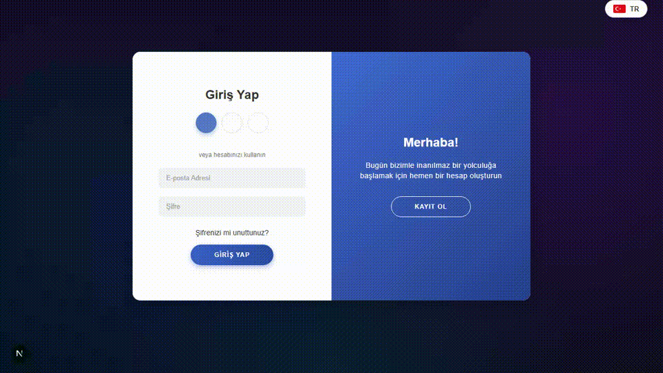
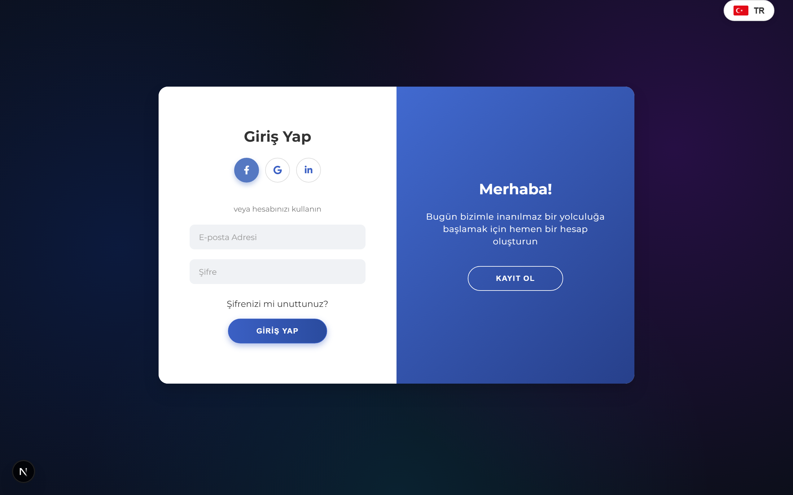
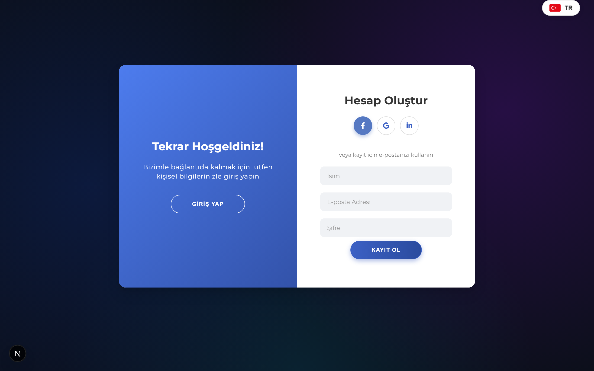
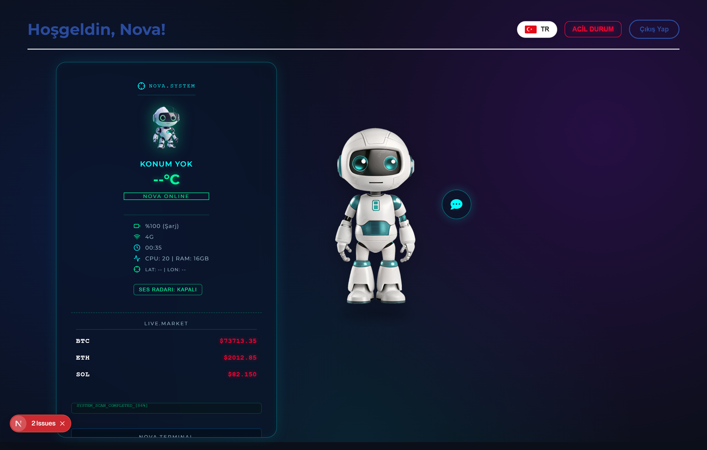
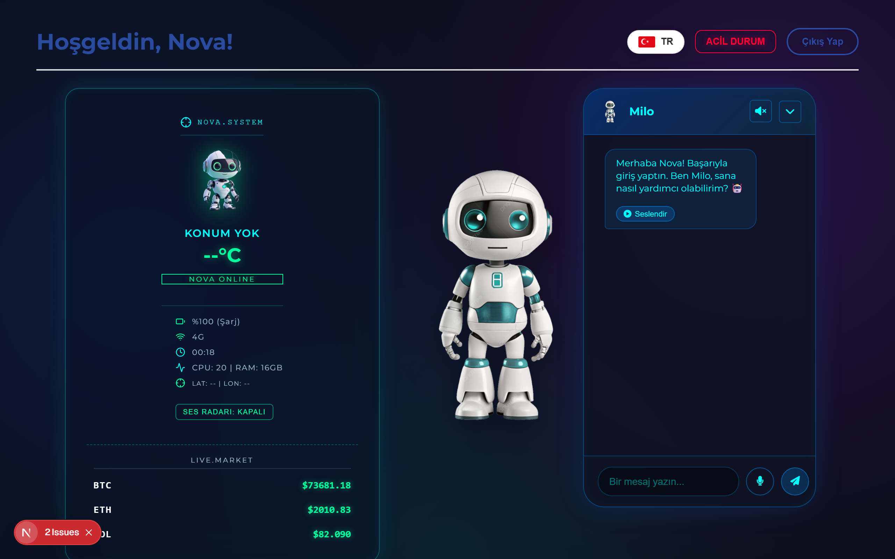

<div align="center">


### 🤖 Sci-Fi AI Giriş Portalı & Akıllı Dashboard

[](https://nextjs.org/)
[](https://react.dev/)
[](https://supabase.com/)
[](https://ai.google.dev/)
[](https://www.electronjs.org/)


<br/>

**Profesyonel giriş ekranı · Supabase kimlik doğrulama · Gemini destekli Milo asistan · Sci-fi kontrol paneli**

[💻 Windows İndir](#-windows-kurulum) · [🚀 Kurulum](#-kurulum) · [✨ Özellikler](#-özellikler) · [📸 Önizleme](#-uygulama-önizlemesi) · [👤 Geliştirici](https://github.com/xeyal9032)

[](https://github.com/xeyal9032/nova-milo/releases/latest)
[](https://github.com/xeyal9032/nova-milo/releases/latest)

</div>

---

## 💻 Windows Kurulum

Kod bilmeden bilgisayarına kurmak için:

1. **[Releases](https://github.com/xeyal9032/nova-milo/releases/latest)** sayfasını aç
2. **`Nova Milo Desktop Setup 0.1.0.exe`** dosyasını indir (~164 MB)
3. Çift tıkla → kurulum sihirbazını tamamla
4. Başlat menüsünden **Nova Milo Desktop** uygulamasını aç

| Gereksinim | |
|------------|---|
| İşletim sistemi | Windows 10/11 (64-bit) |
| İnternet | Giriş, AI sohbet ve canlı veriler için gerekli |

> Geliştiriciler için kaynak koddan kurulum aşağıdaki [Kurulum](#-kurulum) bölümünde.

---

## 🎬 Canlı Demo

<p align="center">
  
</p>

<p align="center"><em>Giriş → kayıt paneli → dashboard → Milo sohbet (gerçek uygulama kaydı)</em></p>

---

## ✨ Özellikler

<table>
<tr>
<td width="50%" valign="top">

### 🔐 Giriş & Kayıt


- Animasyonlu çift panelli giriş ekranı
- Supabase `signUp` / `signInWithPassword`
- **5 dil:** TR · EN · RU · DE · AZ
- Sosyal butonlar (UI hazır)

</td>
<td width="50%" valign="top">

### 🧠 Milo AI Asistan


- Google Gemini ile akıllı sohbet
- Dil bazlı yanıt (seçilen UI dili)
- Markdown mesaj desteği
- OpenAI TTS ile sesli yanıt (`nova` sesi)

</td>
</tr>
<tr>
<td width="50%" valign="top">

### 🛸 Nova Dashboard


- Canlı hava & konum (Open-Meteo)
- Binance WebSocket kripto ticker
- NASA Günün Astronomi Fotoğrafı
- Pil, ağ, CPU/RAM, koordinat HUD

</td>
<td width="50%" valign="top">

### ⌨️ Nova Terminal


```
/weather [şehir]
/crypto
/help
/clear
```

- Matrix tarzı sistem logları
- Acil durum & odak modu
- Web Speech ile sesli giriş

</td>
</tr>
</table>

---

## 📸 Uygulama Önizlemesi

<div align="center">

### 🔐 Giriş & Kayıt Portalı

<table>
<tr>
<td width="50%" align="center">
<strong>Giriş ekranı</strong><br/><br/>

</td>
<td width="50%" align="center">
<strong>Kayıt paneli</strong><br/><br/>

</td>
</tr>
</table>

<br/>

### 🛸 Sci-Fi Dashboard — Nova & Milo



<br/><br/>

### 💬 Milo AI Sohbet



<p><em>Gemini yanıtları · Markdown · Sesli okuma · Mikrofon girişi</em></p>

<table>
<tr>
<td align="center" width="33%">

<br/><strong>Milo</strong>
</td>
<td align="center" width="33%">

<br/><strong>Nova HUD</strong>
</td>
<td align="center" width="33%">

<br/><strong>Maskot</strong>
</td>
</tr>
</table>


</div>

---

## 🏗️ Proje Yapısı

```
giris/
├── 📄 index.html, dashboard.*     # Statik prototip (vanilla)
├── 🖼️ robot.png
└── nextjs-app/                    # ⭐ Ana uygulama
    ├── src/app/
    │   ├── page.js                # Giriş / kayıt
    │   ├── dashboard/page.js      # Nova + Milo dashboard
    │   └── api/chat · api/tts     # Gemini & OpenAI
    ├── src/components/
    ├── src/contexts/
    ├── electron/                  # Masaüstü paket
    └── public/
```

---

## 🛠️ Teknoloji Yığını

| Katman | Teknoliler |
|--------|------------|
| **Frontend** | Next.js 16, React 19, Tailwind CSS 4, CSS Modules |
| **Auth** | Supabase Auth |
| **AI** | Google Gemini 2.5 Flash, OpenAI TTS |
| **Canlı veri** | Open-Meteo, Nominatim, Binance WS, NASA APOD |
| **Masaüstü** | Electron 42 + electron-builder (Windows NSIS) |

---

## 🚀 Kurulum

### Gereksinimler

- Node.js 18+
- npm veya yarn
- Supabase projesi
- `GEMINI_API_KEY` (sohbet için)

### 1. Depoyu klonla

```bash
git clone https://github.com/xeyal9032/nova-milo.git
cd nova-milo/nextjs-app
```

### 2. Bağımlılıkları yükle

```bash
npm install
```

### 3. Ortam değişkenleri

`nextjs-app/.env.local` dosyası oluştur:

```env
GEMINI_API_KEY=your_gemini_api_key
NEXT_PUBLIC_SUPABASE_URL=your_supabase_url
NEXT_PUBLIC_SUPABASE_ANON_KEY=your_supabase_anon_key
OPENAI_API_KEY=your_openai_api_key
```

### 4. Geliştirme sunucusu

```bash
npm run dev
```

Tarayıcıda aç: **http://localhost:3000**

### 5. Masaüstü uygulama

**Kullanıcılar:** [Releases](https://github.com/xeyal9032/nova-milo/releases/latest) üzerinden `.exe` indirin.

**Geliştiriciler:**

```bash
npm run electron-dev      # Geliştirme
npm run build:electron    # Windows kurulum paketi → dist/
```

Yeni sürüm yayınlamak için `dist/*.exe` dosyasını GitHub Release'e yükleyin:

```bash
gh release create v0.2.0 --title "Nova Milo Desktop 0.2.0" \
  --notes "Yenilikler..." \
  "nextjs-app/dist/Nova Milo Desktop Setup 0.1.0.exe"
```

---

## 📜 Komutlar

| Komut | Açıklama |
|-------|----------|
| `npm run dev` | Next.js geliştirme sunucusu |
| `npm run build` | Production build |
| `npm run start` | Production sunucu |
| `npm run electron-dev` | Electron ile masaüstü |
| `npm run build:electron` | Standalone + NSIS installer |

---

## 🗺️ Yol Haritası

- [ ] Route koruması (`middleware` + oturum kontrolü)
- [ ] `signOut` entegrasyonu
- [ ] Şifre sıfırlama (Supabase)
- [x] API anahtarlarının env'e taşınması
- [x] Gerçek ekran görüntüsü ve demo GIF

---

## 👤 Geliştirici

<table>
<tr>
<td align="center">
<a href="https://github.com/xeyal9032">

</a>
<br/><br/>
<strong>Khayal (xeyal9032)</strong><br/>
Web Designer & Developer · OstWind Group
<br/><br/>
<a href="https://github.com/xeyal9032">

</a>
<a href="https://frontend.ostwind.az/">

</a>
<a href="https://www.linkedin.com/in/khayaljamilli9032">

</a>
</td>
</tr>
</table>

---

<div align="center">


⭐ Bu projeyi beğendiysen yıldız vermeyi unutma!

</div>
